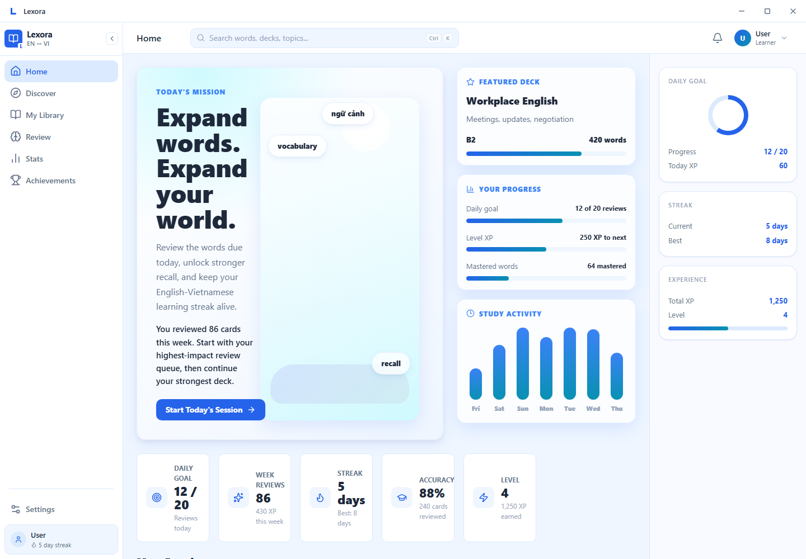
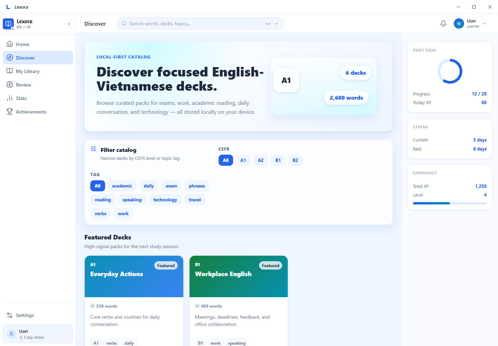
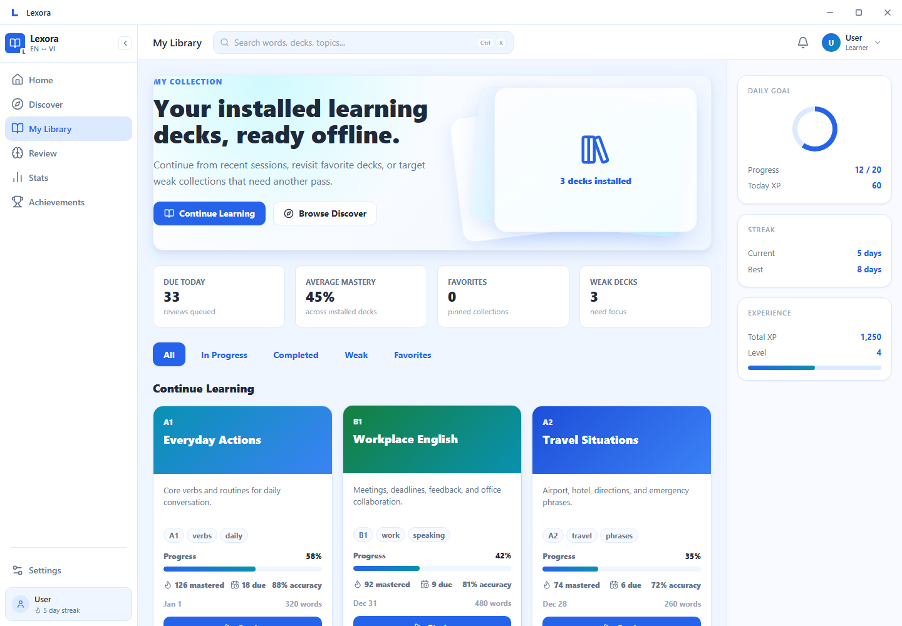
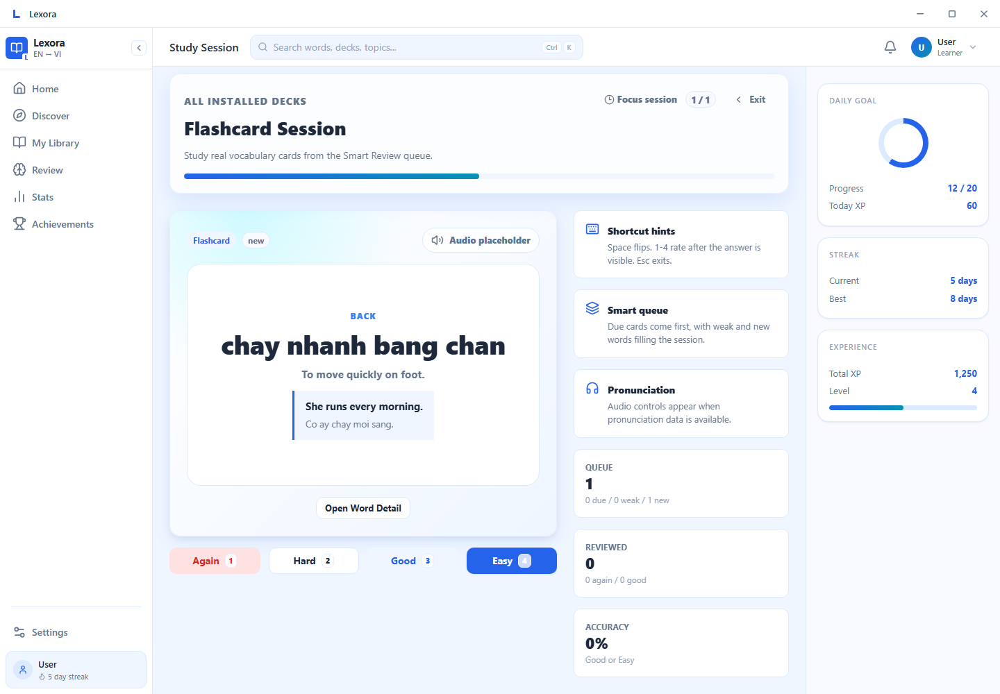
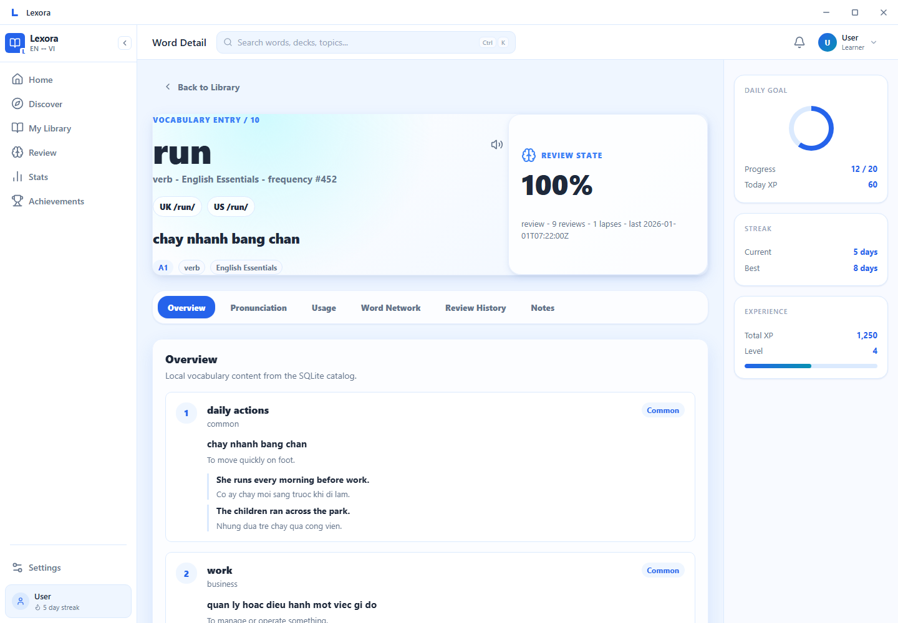
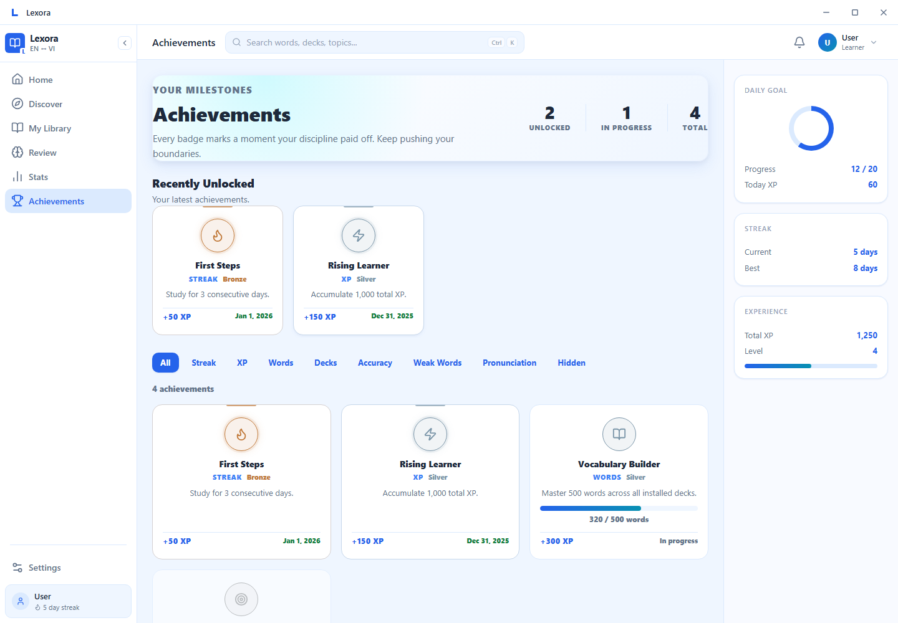
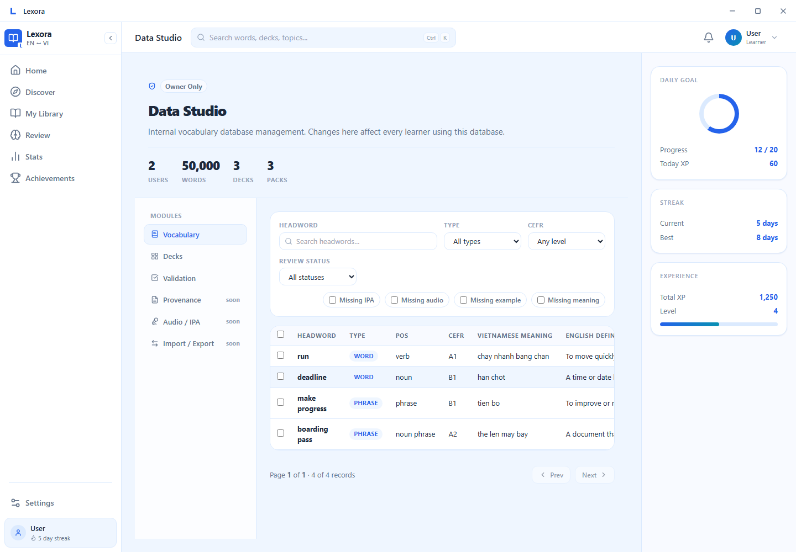
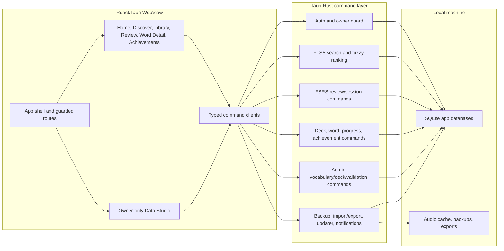

# Lexora

Lexora is a local-first Windows desktop vocabulary app for English <-> Vietnamese learners. It combines a light-blue study dashboard, curated deck discovery, library management, FSRS-style review sessions, word details, achievements, and an owner-only Data Studio for maintaining the local vocabulary database.

Status: portfolio / release-candidate pass. The app is functional as a local desktop project, but public release hardening still needs signed installers, production SQLCipher verification, and final content packaging.



## Screenshots

Screenshots are generated from the local E2E fixture so they can be refreshed without cloud services:

```bash
pnpm screenshots
```

| Home | Discover |
| --- | --- |
|  |  |

| Library | Study Session |
| --- | --- |
|  |  |

| Word Detail | Achievements |
| --- | --- |
|  |  |

| Owner Data Studio |
| --- |
|  |

## Implemented Features

- Local accounts seeded on first launch: `learner / learner` and `owner / owner`.
- Owner-only Admin/Data Studio access enforced in the route layer and native command layer.
- Home dashboard with daily goal, XP, streak, review activity, featured deck, and quick study entry points.
- Discover catalog for local deck packs with filters, install state, and incremental rendering for larger lists.
- My Library view for installed decks with progress, due counts, weak deck filtering, and incremental rendering.
- Flashcard, multiple-choice, type-answer, and weak-word study session surfaces wired through Rust/Tauri commands.
- Word Detail page with senses, examples, IPA/audio metadata, relations, review state, and review history.
- Achievements and progress surfaces backed by native command DTOs.
- Offline SQLite data model with FTS5/fuzzy search and performance indexes for larger vocabulary catalogs.
- Owner Data Studio with paged vocabulary/deck tables, validation/data-quality views, and guarded edit flows.
- Local settings, backup/restore, import/export, notification, updater, and content-update plumbing.

Not included: cloud sync, marketplace/payments, dark mode, public community features, or AI tutor/chat.

## Tech Stack

| Layer | Technology |
| --- | --- |
| Desktop shell | Tauri 2 |
| UI | React 18, TypeScript, Vite |
| Styling | Local CSS, design tokens, light-blue Azure Glass identity |
| Animation | Framer Motion |
| Routing | React Router |
| Icons | Lucide React |
| Charts | Recharts |
| Native layer | Rust |
| Database | SQLite with FTS5; SQLCipher feature available via `--features sqlcipher` |
| Review engine | Rust/TypeScript FSRS scheduling helpers |
| Package manager | pnpm workspaces |
| Testing | Vitest, React Testing Library, Playwright, Rust tests |

## Architecture



More detail: [docs/ARCHITECTURE_DIAGRAM.md](docs/ARCHITECTURE_DIAGRAM.md), [docs/ARCHITECTURE.md](docs/ARCHITECTURE.md), and [docs/PERFORMANCE.md](docs/PERFORMANCE.md).

## Repository Layout

```text
lexora/
  apps/desktop/              Tauri 2 desktop application
  packages/review-engine/    Shared review scheduling helpers
  packages/data-contracts/   Shared IPC/data contracts
  packages/validation/       Shared validation schemas
  data/                      Seed data, packs, manifests, assets
  docs/                      Product, architecture, UI, data model, performance notes
  tests/e2e/                 Playwright tests and screenshot capture
```

## Setup

Prerequisites:

- Node.js 20+
- pnpm 9+
- Rust stable
- Windows 10/11 with WebView2 for the desktop target

Install dependencies:

```bash
pnpm install
```

Run the renderer in browser dev mode:

```bash
pnpm dev
```

Run the full Tauri desktop app:

```bash
pnpm --filter desktop tauri:dev
```

## Build and Package

Build the React/Vite renderer:

```bash
pnpm build
```

Build Windows NSIS and MSI installers:

```bash
pnpm --filter desktop tauri:build:windows
```

Installer outputs are written under:

- `apps/desktop/src-tauri/target/release/bundle/nsis/`
- `apps/desktop/src-tauri/target/release/bundle/msi/`

For a production release, build with the SQLCipher feature enabled and provide signing/updater secrets through CI. Do not commit installer certificates, updater keys, or local user databases.

## Quality Checks

```bash
pnpm typecheck
pnpm --filter desktop test
cargo test --manifest-path apps/desktop/src-tauri/Cargo.toml --lib
pnpm test:e2e
pnpm screenshots
```

Useful focused checks:

```bash
pnpm --filter desktop typecheck
pnpm --filter desktop build
cargo test --manifest-path apps/desktop/src-tauri/Cargo.toml large_catalog_search_benchmark -- --ignored --nocapture
```

## Documentation

- [Product Spec](docs/PRODUCT_SPEC.md)
- [Architecture](docs/ARCHITECTURE.md)
- [Architecture Diagram](docs/ARCHITECTURE_DIAGRAM.md)
- [UI/UX Spec](docs/UI_UX_SPEC.md)
- [Data Model](docs/DATA_MODEL.md)
- [Performance Notes](docs/PERFORMANCE.md)
- [Decisions](docs/DECISIONS.md)

## Roadmap

- Finish public release hardening: signed installer pipeline, SQLCipher release verification, final update manifest flow, and clean install smoke tests.
- Expand curated vocabulary packs, IPA/audio coverage, and Data Studio validation rules.
- Keep cloud sync, marketplace/payments, public community features, dark mode, and AI tutor/chat out of the current release scope.

## License

MIT. See [LICENSE](LICENSE).
