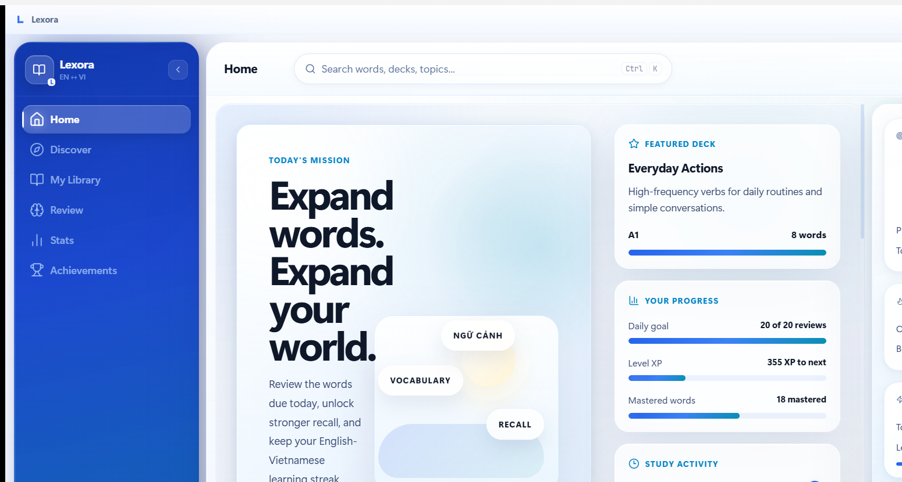
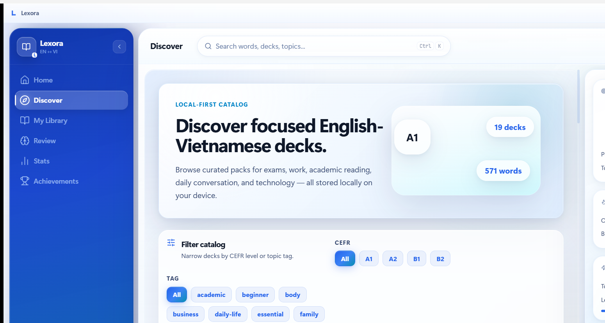
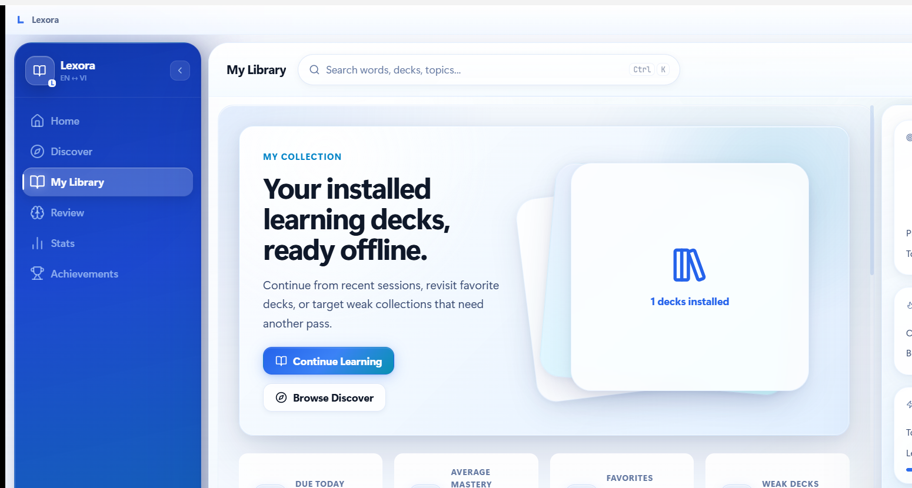
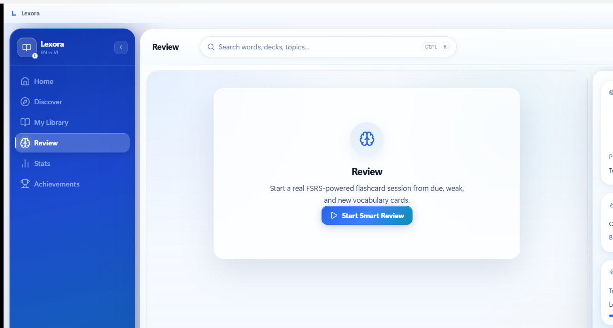
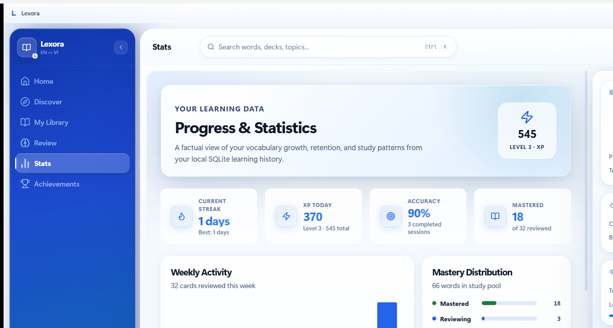
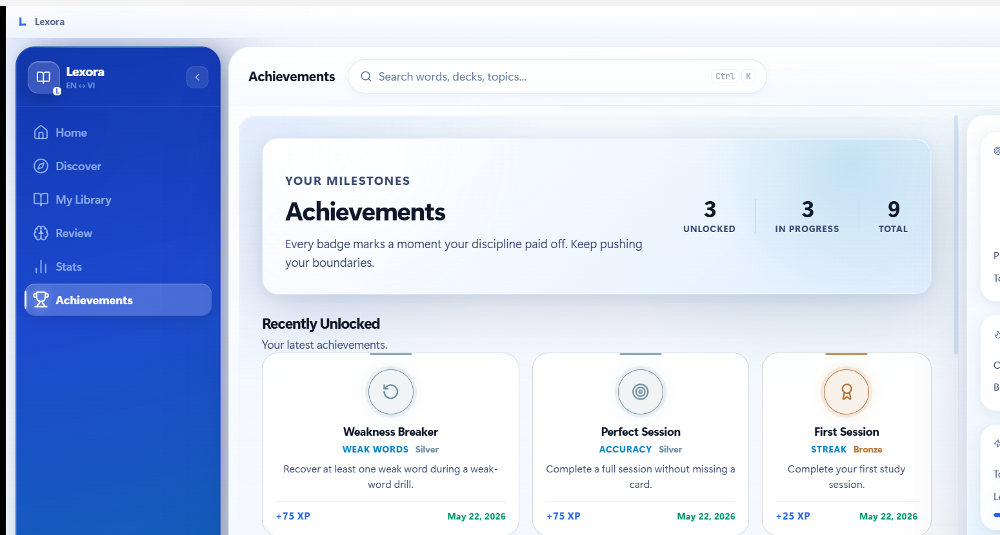
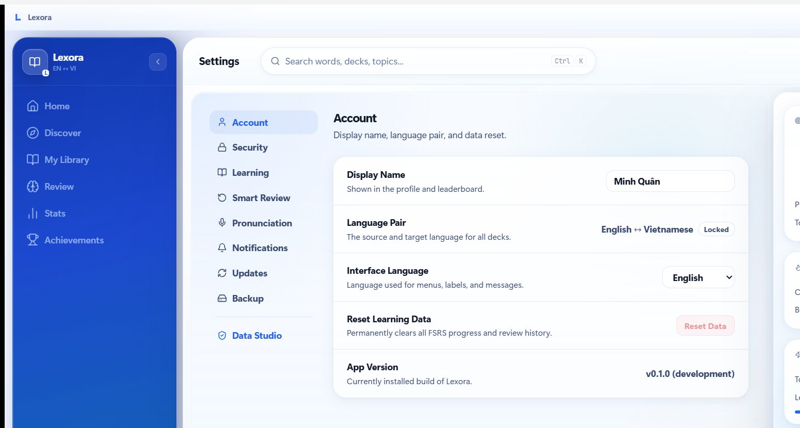
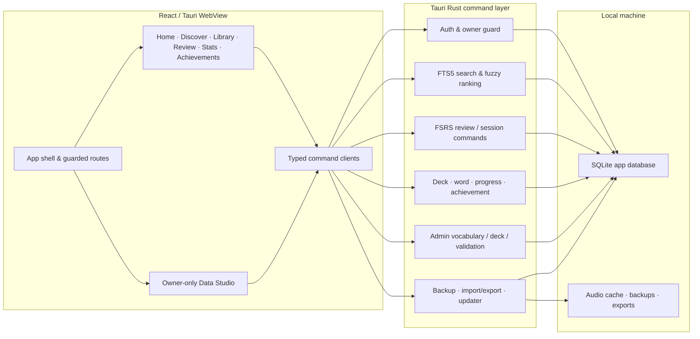

<div align="center">

# Lexora

**Offline-first English ↔ Vietnamese vocabulary for Windows**

<br/>


<br/><br/>


&nbsp;&nbsp;


<br/>


</div>

> [!NOTE]
> **🟢 Actively in development — approaching release candidate.**
> Core features are complete. Signed installer pipeline, SQLCipher release verification, and final content packaging are still in progress.

---

Lexora is a local-first Windows desktop app that makes English ↔ Vietnamese vocabulary study feel fast and focused. Everything runs on your machine — no account required, no cloud, no data leaving your device. Study sessions are powered by FSRS spaced repetition, and a built-in Data Studio lets the owner manage the vocabulary database directly.

## Screenshots

<p align="center">
  
  
</p>
<p align="center">
  
  
</p>
<p align="center">
  
  
</p>
<p align="center">
  
</p>

## Features

| Area | What's included |
| ---- | --------------- |
| **Accounts** | `learner / learner` and `owner / owner` seeded on first launch; owner guard enforced in routes and Rust commands |
| **Home** | Daily goal, XP, streak, review activity heatmap, featured deck, and quick study entry |
| **Discover** | Local deck catalog with CEFR/topic filters, install state, and incremental rendering |
| **Library** | Installed decks with progress bars, due counts, and weak-deck filtering |
| **Study** | Flashcard, multiple-choice, type-answer, and weak-word session modes |
| **Word Detail** | Senses, examples, IPA/audio metadata, relations, review state, and history |
| **Stats** | Progress charts, streak calendar, mastery distribution, and weekly activity |
| **Achievements** | Milestone tracking backed by native command DTOs |
| **Data Studio** | Owner-only paged vocabulary/deck tables, validation views, and guarded edit flows |
| **Data** | SQLite with FTS5 fuzzy search; SQLCipher available via `--features sqlcipher` |
| **Utilities** | Backup/restore, import/export, notifications, and updater plumbing |

**Not included:** cloud sync, marketplace/payments, dark mode, public community features, or AI tutor/chat.

## Tech Stack

| Layer | Technology |
| ----- | ---------- |
| Desktop shell | Tauri 2 |
| UI | React 18, TypeScript, Vite |
| Styling | Local CSS, design tokens, light-blue Azure Glass identity |
| Animation | Framer Motion |
| Routing | React Router |
| Icons | Lucide React |
| Charts | Recharts |
| Native layer | Rust |
| Database | SQLite + FTS5; SQLCipher via `--features sqlcipher` |
| Review engine | FSRS scheduling (Rust + TypeScript) |
| Package manager | pnpm workspaces |
| Testing | Vitest, React Testing Library, Playwright, Rust unit tests |

## Architecture



See also: [Architecture](docs/ARCHITECTURE.md) · [Diagram](docs/ARCHITECTURE_DIAGRAM.md) · [Performance](docs/PERFORMANCE.md)

## Repository Layout

```
lexora/
  apps/desktop/           Tauri 2 desktop application (React + Rust)
  packages/review-engine/ Shared FSRS scheduling helpers
  packages/data-contracts/Shared IPC / data-contract types
  packages/validation/    Shared validation schemas
  data/                   Seed packs, manifests, audio assets
  docs/                   Product spec, architecture, UI/UX, data model
  tests/e2e/              Playwright tests and screenshot capture
```

## Quick Start

**Prerequisites:** Node.js 20+, pnpm 9+, Rust stable, Windows 10/11 with WebView2.

```bash
# Install dependencies
pnpm install

# Run in browser dev mode (no Tauri)
pnpm dev

# Run the full desktop app
pnpm --filter desktop tauri:dev
```

## Build & Package

```bash
# Typecheck and build renderer
pnpm typecheck && pnpm build

# Build Windows NSIS + MSI installers
pnpm --filter desktop tauri:build:windows
```

Installer output:
- `apps/desktop/src-tauri/target/release/bundle/nsis/`
- `apps/desktop/src-tauri/target/release/bundle/msi/`

For a production release, enable `--features sqlcipher` and supply signing/updater secrets through CI. Never commit installer certificates, updater keys, or local databases.

## Quality Checks

```bash
pnpm typecheck
pnpm --filter desktop test
cargo test --manifest-path apps/desktop/src-tauri/Cargo.toml --lib
pnpm test:e2e
pnpm screenshots
```

## Documentation

- [Product Spec](docs/PRODUCT_SPEC.md)
- [Architecture](docs/ARCHITECTURE.md)
- [Architecture Diagram](docs/ARCHITECTURE_DIAGRAM.md)
- [UI/UX Spec](docs/UI_UX_SPEC.md)
- [Data Model](docs/DATA_MODEL.md)
- [Performance Notes](docs/PERFORMANCE.md)
- [Decisions](docs/DECISIONS.md)

## Roadmap

- **Release hardening** — signed installer pipeline, SQLCipher release verification, update manifest flow, clean-install smoke tests
- **Content** — expanded vocabulary packs, broader IPA/audio coverage, additional Data Studio validation rules
- **Out of scope for v1** — cloud sync, marketplace, community features, dark mode, AI tutor/chat

## Community

- [CONTRIBUTING.md](CONTRIBUTING.md) — setup, conventions, quality gates
- [CODE_OF_CONDUCT.md](CODE_OF_CONDUCT.md) — community standards
- [SUPPORT.md](SUPPORT.md) — bug reports, feature requests, security reports
- [PRIVACY.md](PRIVACY.md) — what Lexora stores, what it never collects
- [CHANGELOG.md](CHANGELOG.md) — release history
- [THIRD_PARTY_LICENSES.md](THIRD_PARTY_LICENSES.md) — bundled dependencies

## License

MIT — see [LICENSE](LICENSE). Third-party code: [THIRD_PARTY_LICENSES.md](THIRD_PARTY_LICENSES.md).
