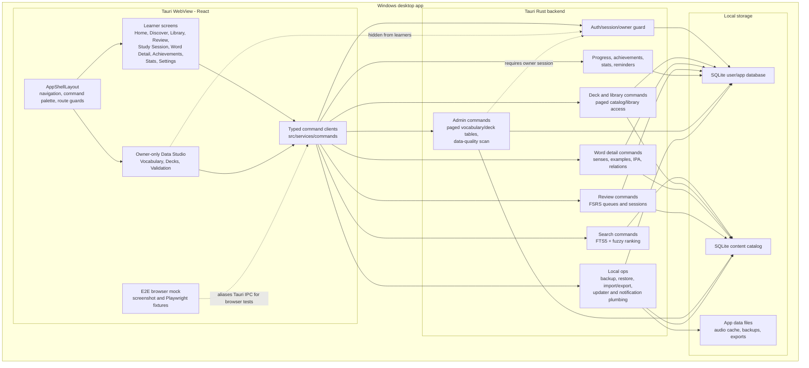

# Lexora Architecture Diagram

This diagram captures the current offline-first desktop architecture and the owner-only Admin/Data Studio boundary. It is intentionally scoped to implemented local workflows and does not include cloud sync, marketplace, public community, or AI tutor services.

## Runtime Boundaries

- The React frontend never connects directly to SQLite. It calls typed Tauri commands.
- The Rust command layer owns database access, auth checks, migration execution, search ranking, review scheduling persistence, and admin enforcement.
- Data Studio is owner-only in the sidebar/route layer and again in every admin command.
- Core learner workflows are local-only and do not need network access.
- Updater/content manifest/TTS-adjacent plumbing is isolated from core study flows.

## Large Catalog Path

- Discover and Library render incrementally instead of mounting every card at once.
- Admin vocabulary and deck tables request pages from Rust instead of loading the whole catalog into the WebView.
- Search is executed in SQLite through indexed/FTS queries before results cross the IPC boundary.
- Heavy owner tooling is lazy-loaded so learner routes do not pay that bundle cost.

See [PERFORMANCE.md](PERFORMANCE.md) for the current large-data notes and benchmark command.
